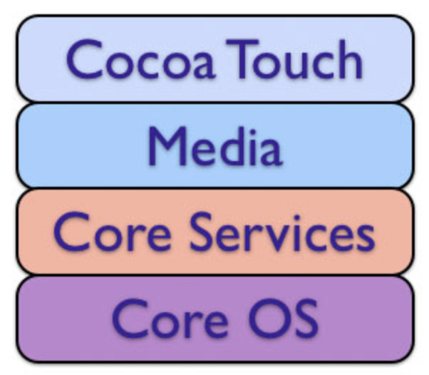

# ProjectA_MusicPlayer

## 0.Hello!
### 배우는 내용
- Xcode 사용법
    - 프로젝트 생성 및 코드작성
    - 인터페이스 빌더를 활용한 UI 구성
    - 유용한 단축키
- UIKit 요소
    - UILabel
    - UIButton
    - UISlider
- 프레임워크
    - UIKit
    - AVFoundation
- 기술요소
    - Auto Layout
- Design Pattern
    - Model-View-Controller Pattern
- 기타 개념
    - IBOutlet, IBAction
    - Assets
    - Bundle
- Timer
## 1.시작 그리고 Xcode
생략   
## 2.애플리케이션 만들기
- 핵심키워드
    - Asset Catalog(에셋 카탈로그)
    > 어플리케이션을 개발할 떄는 수 많은 리소스 파일들이 필요하다. 리소스 파일이란 이미지, 음악파일 등과 같은 여러 파일 형식을 말한다. 이 리소스 파일들을 디바이스마다 크기나 비율을 변경해서 사용해야 하는데 Xcode 에서 이를 해결하기 위해 Asset(이미지,파일 등)을 사용한다.   
    > Asset Catalog는 에셋을 관리하기 위한 폴더이다. Xcode에서 프로젝트를 처음 생성하면 Assets.xcassets 이라는 폴더가 자동으로 생성되는데, 이 폴더에서 애플리케이션에 사용될 다양한 에셋을 관리한다.
    - App Slicing(앱 슬라이싱)
    > 슬라이싱(slicing)은 애플리케이션이 지원하는 다양한 디바이스에 대한 여러 조각의 애플리케이션 번들(app bundle)을 생성하고 디바이스에 알맞은 조각을 전달하는 기술입니다.
    > 개발자가 애플리케이션의 전체 버전을 iTunes Connect에 업로드하게 되면, 앱 스토어에는 각 디바이스 특성에 다양한 버전의 조각들이 생성됩니다. 사용자가 애플리케이션을 설치할 때 전체 버전이 아닌 슬라이싱(slicing)된 조각들 중 사용자의 디바이스의 가장 적합한 조각이 다운로드되어 설치됩니다. 에셋 카탈로그에서 관리하는 이미지들은 자동으로 적용이 됩니다.(슬라이싱(slicing)은 iOS 9.0 이상버전 이상만 지원합니다.)

    > iTunes Connect란 개발자가 앱 스토어에 판매할 애플리케이션을 제출하고 관리할 수 있도록 도와주는 웹 기반 도구입니다.
   
    - App Thinning(앱 시닝)
     > 앱 시닝이란 애플리케이션이 디바이스에 설치될 때 앱 스토어와 운영체제가 그 디바이스의 특성에 맞게 설치하도록 하는 설치 최적화 기술을 의미합니다.
     > 이를 통해 애플리케이션의 설치용량을 최소화하고 다운로드의 속도를 향상시킬 수 있습니다. 앱 시닝(app thinning)의 기술 구성요소는 슬라이싱(slicing), 비트코드(bitcode), 주문형 리소스(on-demand resource)가 있습니다.   
     
     - __MARK__   
     주석으로 MARK를 달고 Properties(속성)와 Methods(함수,기능)를 구분해 놓으면 나중에 관리하기 편하다
~~~swift
// MARK:- Properties
var number: 1
var name: james

// MARK: IBOutlets
@IBOutlet var uiButton: UIButton!
@IBOutlet var uiLabel: UILabel!

// MARK: - Methods
func method(){
}
~~~
여기서 MARK : 뒤에 <code>-</code>를 붙여주면 구분선이 생긴다.    
- AVFoundation
> AVFoundation은 다양한 Apple 플랫폼에서 사운드 및 영상 미디어의 처리, 제어, 가져오기 및 내보내기 등 광범위한 기능을 제공하는 프레임워크입니다.   

- 주요 기능
> 미디어 재생 및 편집
> 디바이스 카메라와 마이크를 이용한 영상 녹화 및 사운드 녹음
> 시스템 사운드 제어
> 문자의 음성화   

## 3. Foundation과 UIKit 그리고 Cocoa Touch
> __Cocoa Touch 프레임워크란?__    
>> 먼저 <code>코코아(Cocoa)</code>라는 단어는, <code>NSObject</code>를 상속받는 모든 클래스, 모든 객체를 가리킬 때 사용하는 단어다.   
>> 코코아 터치 프레임워크란 iOS 개발 환경을 구축하기 위한 최상위 프레임워크다.   
>> 즉, 일반적으로 iOS개발을 위해 <code>Object-C</code> 혹은 <code>Swift</code>에서 상속하여 사용하는 <code>UIkit</code>, <code>Foundation</code>을 포함한 대부분의 클래스, 객체들이 모두 코코아 터치 프레임워크에 속한다.   
>> 참고로 비슷한 이름의 <code>코코아 프레임워크</code>는 <code>macOS</code>개발 환경을 위한 프레임워크라고 한다. 그렇기 때문에, 아이폰, 아이패드 등의 <code>터치기반</code>의 iOS 개발환경에 <code>코코아 터치 프레임워크</code>라는 이름이 붙게된 것 같다.   
>>    
   
> __UIKit 이란?__   
>> <code>UI(User Interface)</code>라는 이름에서 알 수 있듯이, UIKit 프레임워크는 사용자의 인터페이스를 관리하고, 이벤트를 처리하는게 주 목적인 프레임워크다.   
>> UIkit에서 주로 처리하는 사용자 이벤트로는 제스처 처리, 애니메이션, 그림 그리기, 이미지 처리, 텍스트 처리 등이 있다.   
>> 또한 테이블뷰, 슬라이더, 버튼, 텍스트 필드, 얼럿 창 등 애플리케이션의 화면을 구성하는 요소도 포함한다.   
>> 그렇기 때문에, 자주 사용하는 UIViewController, UIView(당연히 이를 상속하는 버튼, 텍스트 필드 등도 포함), UIAlertController등 앞에 UI가 붙는 클래스들을 사용하려면 반드시 UIkit을 상속해야 한다.   
>> ViewController와 UIKit가 왜 함께 쓰이는지에 대한 궁금증 해결   
>> ViewController는 UIViewController를 상속받습니다. UIViewController는 UIKit에 정의된 클래스이고, 사용자의 Interface와 Action을 관리합니다.   
>> import UIKit을 해줌으로써 컴파일러가 UIViewController 클래스를 찾아 빌드를 해줄 수 있습니다.   
   
> __Foundation 이란?__   
>> Foundation은 원시 데이터 타입(String, Int, Double), 컬렉션 타입(Array, Dictionary, Set) 및 운영체제 서비스를 사용해 애플리케이션의 기본적인 기능을 관리하는 프레임워크 입니다.   
   
>>  __Foundation 기능별 요소__   
>> #### 기본    
>>> - Number, Data, String: 원시 데이터 타입 사용
>>> - Collection: Array, Dictionary, Set 등과 같은 컬렉션 타입 사용
>>> - Date and Time: 날짜와 시간을 계산하거나 비교하는 작업
>>> - Unit and Measurement: 물리적 차원을 숫자로 표현 및 관련 단위 간 변환 기능
>>> - Data Formatting: 숫자, 날짜, 측정값 등을 문자열로 변환 또는 반대 작업
>>> - Filter and Sorting: 컬렉션의 요소를 검사하거나 정렬하는 작업   
>> #### 애플리케이션 지원
>>> - Resources: 애플리케이션의 에셋과 번들 데이터에 접근 지원
>>> - Notification: 정보를 퍼뜨리거나 받아들이기는 기능 지원
>>> - App Extension: 확장 애플리케이션과의 상호작용 지원
>>> - Error and Exceptions: API와의 상호작용에서 발생할 수 있는 문제 상황에 대처할 수 있는 기능 지원   
>> #### 파일 및 데이터 관리
>>> - File System: 파일 또는 폴더를 생성하고 읽고 쓰는 기능 관리
>>> - Archives and Serialization: 속성 목록, JSON, 바이너리 파일들을 객체로 변환 또는 반대 작업 관리
>>> - Cloud: 사용자의 iCloud 계정을 이용해 데이터를 동기화하는 작업 관리   
>> #### 네트워킹
>>> - URL Loading System: 표준 인터넷 프로토콜을 통해 URL과 상호작용하고 서버와 통신하는 작업
>>> - Bonjour: 로컬 네트워크를 위한 작업   
> __프레임워크 계층구조__   
~~~swift
import UIKit
class test{
    var value = DataFormatter()
}
~~~
>> 위 코드에서 DataFormatter클래스는 Foundation 프레임워크에 포함된 클래스이다.   
>> 그렇다면 사용하기 위해 <code>import Foundation</code>을 해야 한다.   
>> 하지만 위 코드에서는 UIKit 만 import 했기 떄문에 오류가 발생해야 하나 코드는 정상적으로 작동한다.   
> #### 이유를 알기 위해 프레임워크의 계층 구조에 대해서 알아보자
>>    
>> 코코아 프레임워크는 위와같은 계층 구조를 가지고, 하위 계층일수록 하드웨어에 친화적이고, 반대로 상위 계층일 수록 사용자 친화적이다.   
>> 이 중 UIKit은 가장 위인 Cocoa Touch 계층이고 그보다 두단계 Foundation은 Core Service 계층이다. 그렇기 때문에 UIkit이 Foundation 프레임워크를 상속했을 가능성이 높다.   
>> 실제로 UIKit 프레임워크에서 이미 Foundation 프레임워크를 import 했다. (키보드 Command 버튼을 누른 상태로 UIKit - Jump to Definition을 눌러보면 UIKit 정의를 확인할 수 있는데, import된 Foundation을 확인할 수 있다.)   

> 각 계층의 프레임워크들
> #### Cocoa Touch 계층
>> 하위 계층의 프레임워크를 사용하여 애플리케이션을 직접 구현하는 프레임워크.   
>> <code>UIKit</code>,<code>GameKit</code>, <code>MapKit</code>.  

> #### Media 계층
>> 상위 계층인 코코아 터치 계층에 그래픽 관련 서비스나 멀티미디어 관련 서비스를 제공.  
>> <code>Core Graphics</code>, <code>Core Text</code>, <code>Core Audio</code>, <code>Core Animation</code>, <code>AVFoundation</code>.  

> #### Core Service 계층
>> 문자열 처리, 데이터 집합 관리, 네트워크, 주소록 관리, 환경 설정 등 핵심적인 서비스들을 제공.   
>> 또한 GPS, 나침반, 가속도 센서나 자이로스코프 센서와 같이 디바이스의 하드웨어 특성에 기반한 서비스도 제공.   
>> <code>Foundation</code>, <code>Core Foundation</code>, <code>Core Location</code>, <code>Core Motion</code>, <code>Core Animation</code>, <code>Core Data</code>.  

> #### Core OS 계층
>> 커널, 파일 시스템, 네트워크, 보안, 전원 관리, 디바이스 드라이버 등이 포함   
>> iOS가 운영 체제로서 기능을 하기 위한 핵심적인 영역.   

## 4. Auto Layout
> #### 오토레이아웃이란?
> 아이폰 기종별로 각기 다른 사이즈,화면 비율, 해상도에 구애받지 않고 시각적으로 동일한 화면을 구현하기 위해 권장되는 기술.  

> 예제로 주신 MyMusicPlayer는 오토레이아웃이 코드로 구현되어있고, 인터페이스 빌더를 이용해서 구현하였다.   
> 나중에 코드로 구현한 예제를 다시 꼭 확인하고 익혀보자!   
## 5. iOS의 View 체계
> iOS에서 화면에 애플리케이션의 콘텐츠를 나타내기 위해 윈도우와 뷰를 사용합니다. 윈도우는 그 자체로 콘텐츠를 표현할 수 없지만 애플리케이션의 뷰를 위한 컨테이너 역할을 합니다. 뷰는 UIView 클래스 또는 UIView 클래스의 하위클래스(Subclass)의 인스턴스로 윈도우의 한 영역에서 콘텐츠를 보여줍니다. 뷰가 나타낼 수 있는 콘텐츠는 이미지, 문자, 도형 등과 같이 다양합니다. 뷰는 또 다른 뷰를 관리하고 구성하기 위해 사용되기도 합니다.   
## 6. MVC
> #### 프로그래밍 디자인 패턴이란 무엇인가? 
> 프로그래밍 디자인 패턴은 소프트웨어를 설계할 때 특정 상황에서 자주 사용하는 패턴을 정형화한 것이며, 좋은 소프트웨어 설계를 위한 개발자들의 경험적 산물이라고 할 수 있다.  
> #### 프로그래밍 디자인 패턴의 특징
> - 경험을 통하여 얻을 수 있다.   
> - 특정한 형식을 갖고 체계적으로 작성되는 것이 일반적이다.   
> - 패턴에는 각기 다른 추상화 수준이 존재하며 계속 진화한다.     
> #### 프로그래밍 디자인 패턴의 장점
> 의사소통에 도움을 준다. 디자인 패턴을 알고 있는 설계자들은 특정 문제에 대해 공통으로 알고 있는 패턴을 이용해 해결책에 대해 논의를 할 수 있기 때문에 더욱 원활하게 의사소통할 수 있다.   
> 검증된 지식인 패턴을 사용하면 높은 완성도의 디자인을 빠른 시간에 만들어 낼 수 있기 때문에 소프트웨어 개발 비용을 줄일 수 있어서 경제적이다. 또한, 코드의 수준을 한 단계 높여 주고 적은 수의 클래스로 원하는 목적을 달성할 수 있는 환경이 제공된다.   
> 좋은 설계나 아키텍처가 패턴이라는 이름으로 명명되어 있어 개발자는 그 패턴의 이름만으로도 그 소프트웨어의 구조를 알 수 있다. 이를 바탕으로 이전의 소프트웨어 개발에서 사용한 설계나 구조를 쉽게 이해할 수 있고, 새로운 소프트웨어로 빠르게 적용할 수 있어서 소프트웨어 재사용을 쉽게 해준다.   
> #### 디자인 패턴의 종류
> - 싱글턴 패턴 (Singleton Pattern)   
> - 퍼사드 패턴 (Facade Pattern)    
> - 옵저버 패턴 (Observer Pattern)   
> - 스트래티지 패턴 (Strategy Pattern)   
> - 팩토리 패턴 (Factory Pattern)   
> - 어댑터 패턴 (Adapter Pattern)   

> #### MVC Pattern
> MVC는 Model-View-Controller의 약자이다. 개발할 때 3가지 형태로 구분하여 개발하는 소프트웨어 개발 방법론이다.
> ##### Model
> 애플리케이션과 관련된 데이터를 캡슐화하고, 해당 데이터를 조작하고 처리하는 로직과 계산을 정의   
> 무엇을 할 것 인지에 대한 정의
> ##### View 
> 뷰 객체는 애플리케이션 내에서 사용자가 볼 수 있는 객체(모바일이라면 어플의 화면, 보여지는 부분)   
> ##### Controller
> 컨트롤러 객체는 하나 이상의 애플리케이션 <code>View</code> 객체와 하나 이상의 <code>Model</code> 객체 사이의 코디네이터 또는 중개자 역할을 한다.   

> ##### MVC의 문제점과 파생된 패턴들
> 다수의 View와 Model이 Controller를 통해 복잡하게 연결될 수 있기 때문에 Controller가 뚱뚱해지게 되는 Massive ViewController(대규모 MVC 어플리케이션)가 되어버리는 문제점이있다.    
> View와 Controller가 라이브사이클에 강하게 연결되어있고, 더불어 Controller를 통해 View와 Model간에도 관계가 복잡하게 연결되어있어서 수정시 테스트가 힘들고, 파악이 어렵기 때문에 여러 Side-Effect를 불러오게 되는 문제점이 있다.   
   
> MVC는 복잡한 대규모 프로그램을 개발을 하게 되면서 이러한 문제점이 확인 되었기 때문에 문제점을 보완한 여러 다양한 패턴이 파생되었다.     
> <code>MVP</code>, <code>MVVM</code>, <code>Viper</code>, <code>Clean Architecture</code>, <code>Flux</code>, <code>Redux</code>, <code>RxMVVM</code>….   

## 7. Apple Developer Documentation

## 8. Summary

## 참조
[Naver_BoostCourse_iOS](https://www.edwith.org/boostcourse-ios/joinLectures/12899,"네이버")
<https://velog.io/@wan088/iOS-%ED%94%84%EB%A0%88%EC%9E%84%EC%9B%8C%ED%81%AC-CocoaTouch-Foundation-UIkit-sjjzdqmte4>
