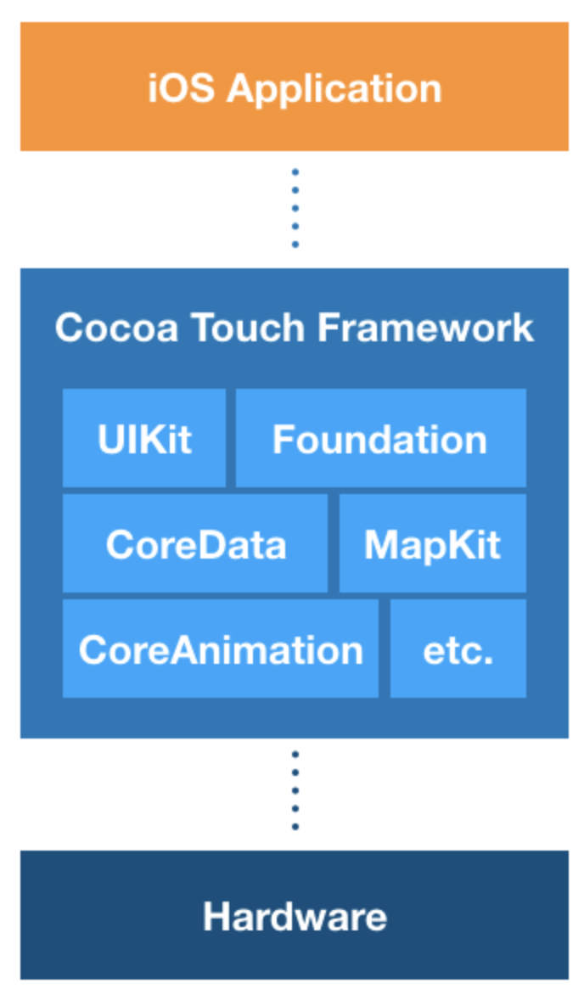

# ProjectA_MusicPlayer
>문서기반
[Naver_BoostCourse_iOS](https://www.edwith.org/boostcourse-ios/joinLectures/12899,"네이버")
## 0.Hello!
### 배우는 내용
- Xcode 사용법
    - 프로젝트 생성 및 코드작성
    - 인터페이스 빌더를 활용한 UI 구성
    - 유용한 단축키
- UIKit 요소
    - UILabel
    - UIButton
    - UISlider
- 프레임워크
    - UIKit
    - AVFoundation
- 기술요소
    - Auto Layout
- Design Pattern
    - Model-View-Controller Pattern
- 기타 개념
    - IBOutlet, IBAction
    - Assets
    - Bundle
- Timer
## 1.시작 그리고 Xcode
생략   
## 2.애플리케이션 만들기
- 핵심키워드
    - Asset Catalog(에셋 카탈로그)
    > 어플리케이션을 개발할 떄는 수 많은 리소스 파일들이 필요하다. 리소스 파일이란 이미지, 음악파일 등과 같은 여러 파일 형식을 말한다. 이 리소스 파일들을 디바이스마다 크기나 비율을 변경해서 사용해야 하는데 Xcode 에서 이를 해결하기 위해 Asset(이미지,파일 등)을 사용한다.   
    > Asset Catalog는 에셋을 관리하기 위한 폴더이다. Xcode에서 프로젝트를 처음 생성하면 Assets.xcassets 이라는 폴더가 자동으로 생성되는데, 이 폴더에서 애플리케이션에 사용될 다양한 에셋을 관리한다.
    - App Slicing(앱 슬라이싱)
    > 슬라이싱(slicing)은 애플리케이션이 지원하는 다양한 디바이스에 대한 여러 조각의 애플리케이션 번들(app bundle)을 생성하고 디바이스에 알맞은 조각을 전달하는 기술입니다.
    > 개발자가 애플리케이션의 전체 버전을 iTunes Connect에 업로드하게 되면, 앱 스토어에는 각 디바이스 특성에 다양한 버전의 조각들이 생성됩니다. 사용자가 애플리케이션을 설치할 때 전체 버전이 아닌 슬라이싱(slicing)된 조각들 중 사용자의 디바이스의 가장 적합한 조각이 다운로드되어 설치됩니다. 에셋 카탈로그에서 관리하는 이미지들은 자동으로 적용이 됩니다.(슬라이싱(slicing)은 iOS 9.0 이상버전 이상만 지원합니다.)

    > iTunes Connect란 개발자가 앱 스토어에 판매할 애플리케이션을 제출하고 관리할 수 있도록 도와주는 웹 기반 도구입니다.
   
    - App Thinning(앱 시닝)
     > 앱 시닝이란 애플리케이션이 디바이스에 설치될 때 앱 스토어와 운영체제가 그 디바이스의 특성에 맞게 설치하도록 하는 설치 최적화 기술을 의미합니다.
     > 이를 통해 애플리케이션의 설치용량을 최소화하고 다운로드의 속도를 향상시킬 수 있습니다. 앱 시닝(app thinning)의 기술 구성요소는 슬라이싱(slicing), 비트코드(bitcode), 주문형 리소스(on-demand resource)가 있습니다.   
     
     - __MARK__   
     주석으로 MARK를 달고 Properties(속성)와 Methods(함수,기능)를 구분해 놓으면 나중에 관리하기 편하다
~~~swift
// MARK:- Properties
var number: 1
var name: james

// MARK: IBOutlets
@IBOutlet var uiButton: UIButton!
@IBOutlet var uiLabel: UILabel!

// MARK: - Methods
func method(){
}
~~~
여기서 MARK : 뒤에 <code>-</code>를 붙여주면 구분선이 생긴다.    
- AVFoundation
> AVFoundation은 다양한 Apple 플랫폼에서 사운드 및 영상 미디어의 처리, 제어, 가져오기 및 내보내기 등 광범위한 기능을 제공하는 프레임워크입니다.   

- 주요 기능
> 미디어 재생 및 편집
> 디바이스 카메라와 마이크를 이용한 영상 녹화 및 사운드 녹음
> 시스템 사운드 제어
> 문자의 음성화   

## 3. Foundation과 UIKit 그리고 Cocoa Touch
> __Cocoa Touch 프레임워크란?__    
>> 먼저 <code>코코아(Cocoa)</code>라는 단어는, <code>NSObject</code>를 상속받는 모든 클래스, 모든 객체를 가리킬 때 사용하는 단어다.   
>> 코코아 터치 프레임워크란 iOS 개발 환경을 구축하기 위한 최상위 프레임워크다.   
>> 즉, 일반적으로 iOS개발을 위해 <code>Object-C</code> 혹은 <code>Swift</code>에서 상속하여 사용하는 <code>UIkit</code>, <code>Foundation</code>을 포함한 대부분의 클래스, 객체들이 모두 코코아 터치 프레임워크에 속한다.   
>> 참고로 비슷한 이름의 <code>코코아 프레임워크</code>는 <code>macOS</code>개발 환경을 위한 프레임워크라고 한다. 그렇기 때문에, 아이폰, 아이패드 등의 <code>터치기반</code>의 iOS 개발환경에 <code>코코아 터치 프레임워크</code>라는 이름이 붙게된 것 같다.   
    
## 4. Auto Layout

## 5. iOS의 View 체계

## 6. MVC

## 7. Apple Developer Documentation

## 8. Summary

