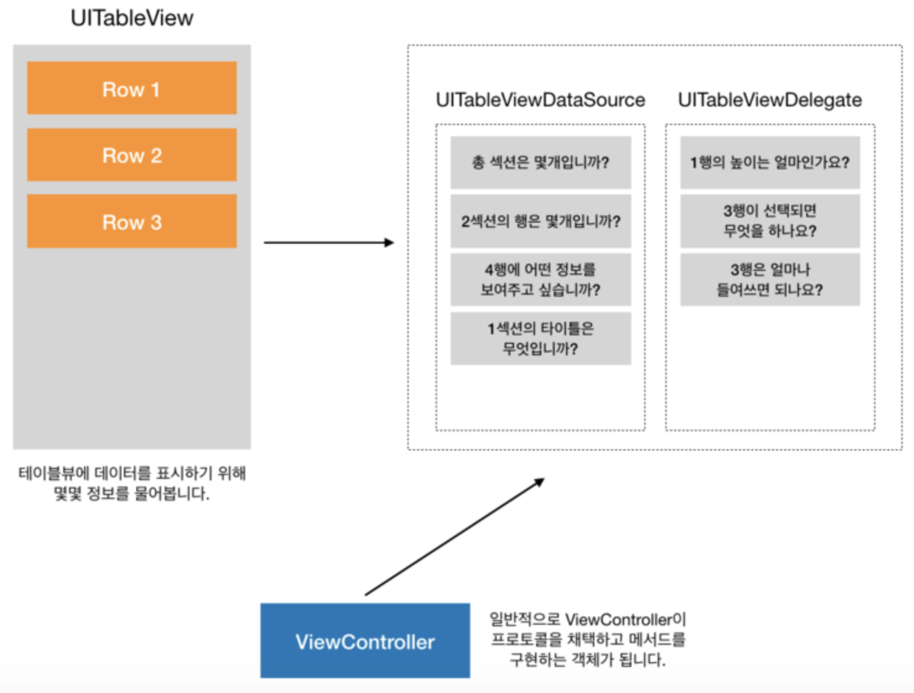

# ProjectC_Weather
## 0. Hello
### 왜 이 프로젝트를 할까?
>> iOS 애플리케이션의 많은 화면을 차지하는 테이블뷰를 익힐 수 있습니다.    
>> 또, 일정한 정보의 흐름을 가지고 화면을 전환할 때 사용하는 내비게이션 화면전환도 다시 활용합니다.     
>> 더불어 테이블뷰 사용을 위해 지난 프로젝트에서 배웠던 Delegation 디자인 패턴도 활용합니다.      
>> JSON 형식은 데이터를 주고받을 때 객체의 형태로 정보를 주고받기 용이하도록 고안된 방식 중 하나입니다.    
>> JSON 데이터를 스위프트에서 쉽게 다룰 수 있는 방법에 대해서도 알 수 있습니다.   
### 새로 배우는 내용
 - UIKit
    - UITableView
    - UITableViewCell
    - View Reuse
    - Table View Cell Customize
- Swift
    - Codable
    - JSONDecoder
### 되짚어볼 개념
- Design Patterns
    - Delegation Pattern
- View Transition
    - Navigation Interface
## 1. 테이블뷰
### 테이블뷰란?
>> 테이블뷰는 iOS 애플리케이션에서 많이 활용하는 사용자 인터페이스입니다.    
>> 테이블뷰는 리스트 형태를 지니고 있으며 스크롤이 가능해 많은 정보를 보여 줄 수 있습니다.    
>> 다양한 용도로 사용하는 테이블뷰의 특징과 구성요소에 대해 알아보도록 합시다.   
### 테이블뷰 생성
 - 동적 프로토타입(Dynamic Prototypes)
    - 셀 하나를 디자인해 이를 다른 셀의 템플릿으로 사용하는 방식
    - 같은 레이아웃의 셀을 여러 개 이용해 정보를 표시할 경우
    - 데이터 소스(UITableViewDataSource) 인스턴스에 의해 콘텐츠를 관리하며, 셀의 개수가 상황에 따라 변하는 경우에 사용
 - 정적 셀(Static Cells)
    - 고유의 레이아웃과 고정된 수의 행을 가지는 테이블뷰에 사용
    - 테이블뷰를 디자인하는 시점에 테이블의 형태와 셀의 개수가 정해져 있는 경우 사용
    - 셀의 개수가 변하지 않음
### 테이블뷰 구성요소
>> 테이블뷰를 구성하기 위해 꼭 알아야 하는 개념에는 셀(cell), 델리게이트(delegate) 그리고 데이터 소스(data source)가 있습니다.   
### 테이블뷰셀 주의사항
>> UITableViewCell의 서브클래스를 이용해 커스텀 이미지뷰를 생성하는 경우, 이미지뷰의 변수명을 imageView로 명명하면 기본 이미지뷰 프로퍼티와 변수명이 같아 원하는 대로 동작하지 않을 수 있으니 반드시 커스텀 이미지뷰의 변수명은 다르게 지어주세요.  
>> (예. detailImageView, thumbnailImageView, profileImageView). textLabel, detailLabel, accessoryView 등의 기본 프로퍼티 이름 모두 마찬가지입니다.   
### 테이블뷰 데이터 소스와 델리게이트
>> 테이블뷰에 원하는 정보를 표시하고, 사용자 선택에 적절히 반응하는 테이블뷰 구현을 위해 꼭 필요한 데이터 소스와 델리게이트에 대해 알아보도록 합시다.   
>> UITableView 객체는 데이터 소스와 델리게이트가 없다면 정상적으로 동작하기 어려우므로 두 객체가 꼭 필요합니다.   
>> MVC(Model-View-Controller) 프로그래밍 디자인 패턴에 따라 데이터 소스는 애플리케이션의 데이터 모델(M)과 관련되어 있으며, 델리게이트는 테이블뷰의 모양과 동작을 관리하기에 컨트롤러(C)의 역할에 가깝습니다. 
>> 테이블뷰는 뷰(V)의 역할을 합니다.
>> 데이터 소스와 델리게이트 덕분에 테이블뷰를 매우 유연하게 만들 수 있습니다.   
>>   

### 데이터 소스
 - 테이블뷰 데이터 소스 객체는 UITableViewDataSource 프로토콜을 채택합니다.   
 - 데이터 소스는 테이블 뷰를 생성하고 수정하는데 필요한 정보를 테이블뷰 객체에 제공합니다.   
 - 데이터 소스는 데이터 모델의 델리게이트로, 테이블뷰의 시각적 모양에 대한 최소한의 정보를 제공합니다.   
 - UITableView 객체에 섹션의 수와 행의 수를 알려주며, 행의 삽입, 삭제 및 재정렬하는 기능을 선택적으로 구현할 수 있습니다.   
 - UITableViewDataSource 프로토콜의 주요 메서드는 아래와 같습니다.    
 - 이 중 @required로 선언된 두 가지 메서드는 UITableViewDataSource 프로토콜을 채택한 타입에 필수로 구현해야 합니다.   
~~~
@required 
// 특정 위치에 표시할 셀을 요청하는 메서드
func tableView(UITableView, cellForRowAt: IndexPath) 

// 각 섹션에 표시할 행의 개수를 묻는 메서드
func tableView(UITableView, numberOfRowsInSection: Int)

@optional
// 테이블뷰의 총 섹션 개수를 묻는 메서드
func numberOfSections(in: UITableView)

// 특정 섹션의 헤더 혹은 푸터 타이틀을 묻는 메서드
func tableView(UITableView, titleForHeaderInSection: Int)
func tableView(UITableView, titleForFooterInSection: Int)

// 특정 위치의 행을 삭제 또는 추가 요청하는 메서드
func tableView(UITableView, commit: UITableViewCellEditingStyle, forRowAt: IndexPath)

// 특정 위치의 행이 편집 가능한지 묻는 메서드
func tableView(UITableView, canEditRowAt: IndexPath)

// 특정 위치의 행을 재정렬 할 수 있는지 묻는 메서드
func tableView(UITableView, canMoveRowAt: IndexPath)

// 특정 위치의 행을 다른 위치로 옮기는 메서드
func tableView(UITableView, moveRowAt: IndexPath, to: IndexPath)
~~~
### 델리게이트
 - 테이블뷰 델리게이트 객체는 UITableViewDelegate 프로토콜을 채택합니다.
 - 델리게이트는 테이블뷰의 시각적인 부분 수정, 행의 선택 관리, 액세서리뷰 지원 그리고 테이블뷰의 개별 행 편집을 도와줍니다.
 - 델리게이트 메서드를 활용하면 테이블뷰의 세세한 부분을 조정할 수있습니다.
 - UITableViewDelegate 프로토콜의 주요 메서드는 아래와 같습니다. 
 - 이 중 필수로 구현해야 하는 메서드는 없습니다.
 ~~~
 // 특정 위치 행의 높이를 묻는 메서드
 func tableView(UITableView, heightForRowAt: IndexPath)
 // 특정 위치 행의 들여쓰기 수준을 묻는 메서드
 func tableView(UITableView, indentationLevelForRowAt: IndexPath)

 // 지정된 행이 선택되었음을 알리는 메서드
 func tableView(UITableView, didSelectRowAt: IndexPath)

 // 지정된 행의 선택이 해제되었음을 알리는 메서드
 func tableView(UITableView, didDeselectRowAt: IndexPath)

 // 특정 섹션의 헤더뷰 또는 푸터뷰를 요청하는 메서드
 func tableView(UITableView, viewForHeaderInSection: Int)
 func tableView(UITableView, viewForFooterInSection: Int)

 // 특정 섹션의 헤더뷰 또는 푸터뷰의 높이를 물어보는 메서드
 func tableView(UITableView, heightForHeaderInSection: Int)
 func tableView(UITableView, heightForFooterInSection: Int)

 // 테이블뷰가 편집모드에 들어갔음을 알리는 메서드
 func tableView(UITableView, willBeginEditingRowAt: IndexPath)

 // 테이블뷰가 편집모드에서 빠져나왔음을 알리는 메서드
 func tableView(UITableView, didEndEditingRowAt: IndexPath?)
~~~

## 2. 뷰의 재사용
### 뷰의 재사용
>> iOS 기기는 한정된 메모리를 가지고 애플리케이션을 구동합니다. 만약 사용자에게 보여주고 싶은 데이터가 매우 많고, 데이터의 양만큼 많은 뷰가 필요하다면 어떻게 될까요?    
>> 화면에 표시할 수 있는 뷰의 개수는 한정되어 있지만, 표현해야 하는 데이터가 많은 경우 반복된 뷰를 생성하기보다는 뷰를 재사용할 수 있습니다.   
>> 사용할 수 있는 메모리가 작아서 데이터의 양만큼 많은 뷰를 생성하는 것은 메모리를 많이 낭비할 수밖에 없기 때문입니다. 뷰를 재사용함으로써 메모리를 절약하고 성능 또한 향상할 수 있습니다.   

### 재사용의 대표적인 예
>> iOS 환경에서 뷰를 재사용하는 대표적인 예로 UITableViewCell, UICollectionViewCell 등이 있습니다.   
 - UITableViewCell : UITableView의 셀입니다.
 - UICollectionViewCell : UICollectionView의 셀입니다.   
 
## 3. 스토리보드 세그
### 세그란?
>> 세그는 스토리보드에서 뷰 컨트롤러 사이의 화면전환을 위해 사용하는 객체입니다. 별도의 코드 없이도 스토리보드에서 세그를 연결하여 뷰 컨트롤러 사이의 화면전환을 구현할 수 있습니다.   

### 주요 프로퍼티
 - var source: UIViewController : 세그에 전환을 요청하는 뷰 컨트롤러입니다.   
 - var destination: UIViewController : 전환될 뷰 컨트롤러입니다.   
 - var identifier: String? : 세그 객체의 식별자입니다.   
 
 ### 주요 메서드
  - func perform() : 뷰 컨트롤러의 전환을 수행합니다.   
  
## 4. JSON 다루기
### 인코딩과 디코딩
>> 인코딩(Encoding)은 정보의 형태나 형식을 표준화, 보안, 처리 속도 향상, 저장 공간 절약 등을 위해서 다른 형태나 형식으로 변환하는 처리 혹은 그 처리 방식을 뜻합니다(출처 : 위키백과 - 부호화).   
>> 디코딩(Decoding)은 인코딩의 반대 작업을 수행하는 것을 뜻합니다.   
>> 또, 인코더(Encoder)는 부호화를 수행하는 장치나 회로, 컴퓨터 소프트웨어, 알고리즘을 뜻합니다.   

### Codable
>> 스위프트 4 버전에서는 스위프트의 인스턴스를 다른 데이터 형태로 변환하고 그 반대의 역할을 수행하는 방법을 제공합니다.    
>> 스위프트의 인스턴스를 다른 데이터 형태로 변환할 수 있는 기능을 Encodable 프로토콜로 표현하였고, 그 반대의 역할을 할 수 있는 기능을 Decodable로 표현해 두었습니다.     
~~~그 둘을 합한 타입을 Codable로 정의해 두었습니다.
~~~   
### Decodable
 - 스위프트 타입의 인스턴스로 디코딩할 수 있는 프로토콜입니다.
### Encodable
 - 스위프트 타입의 인스턴스를 인코딩할 수 있는 프로토콜입니다.

### JSONEncoder / JSONDecoder

>> 스위프트 4 버전 이전에는 JSONSerialization을 사용해 JSON 타입의 데이터를 생성했습니다.   
>> 그러나 스위프트 4 버전부터 JSONEncoder / JSONDecoder가 Codable 프로토콜을 지원하기 때문에 JSONEncoder / JSONDecoder와 Codable 프로토콜을 이용해 손쉽게 JSON 형식으로 인코딩 및 디코딩할 수 있습니다.   
>> 즉, JSONEncoder 및 JSONDecoder를 활용하여 스위프트 타입의 인스턴스를 JSON 데이터로 인코딩, JSON 데이터에서 스위프트 타입의 인스턴스로 디코딩할 수 있습니다.   

## 5. Summary
### 프로젝트C 준비
해야할것
세개의 뷰 컨트롤러 필요( 첫화면, 국가선택했을때화면, 도시를 선택했을때 화면)
화면전환 네비게이션을 이용하는 것이 좋아보임
(네비게이션바색상, 타이틀색상변경), 테이블뷰,셀 추가, UITableview 연결, extension dataSource,delegate 하고 프로토콜 (꼭선언해야하는 메소드 선언, numberOfRowsInSection, cellForRowAt)
>>>>>>cellForRowAt 안에 코드 수정하고 , 커스텀셀 만들어야됨, 만들고 identify 커스텀 셀로 수정하고  ,그리고 데이터가 보이게끔 코드 넣고확인(json데이터 구조 만들고 그 구조로 받고 보여주기)

## 참조
[Naver_BoostCourse_iOS](https://www.edwith.org/boostcourse-ios/joinLectures/12899,"네이버")

