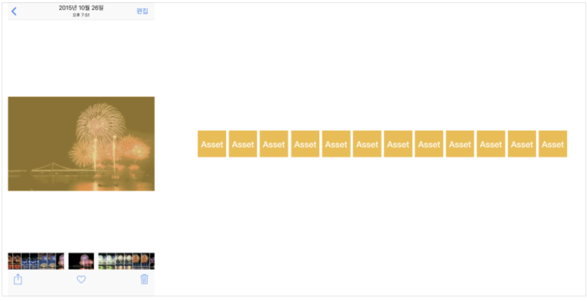

# ProjectD_Album
## 0. Hello
### 왜 이 프로젝트를 할까?
테이블뷰와 더불어 많은 정보를 화면에 표시할 수 있는 컬렉션뷰를 활용해 볼 수 있습니다.    
또, 많은 이미지를 메인 스레드에서 한 번에 처리하면 화면이 멈추는 프리징 현상이 발생할 수 있습니다.   
이를 대비하여 메인 스레드 외에 다른 스레드에서 이미지를 불러오는 비동기 프로그래밍을 경험할 수 있습니다.   

### 새로 배우는 내용
 - Framework
    - Photos
 - UIKit
    - UICollectionView
    - UICollectionViewCell
    - UICollectionViewFlowLayout
    - UINavigationItem
    - UIBarButtonItem
    - UIStoryboardSegue
    - UIScrollView
 - Concurrency Programming(동시성 프로그래밍)
    - Asynchronous Programming(비동기 프로그래밍)
    - OperationQueue
### 되짚어볼 개념
 - Design Patterns
    - Delegation Pattern
 - View Transition
    - Navigation Interface
 - View Reuse
 - Auto Layout
 
## 1. Photos
### Photos 프레임워크
>> iOS 및 tvOS에서 iCloud 사진 라이브러리를 포함하여 사진 및 비디오에 직접 접근하기 위한 Photos 프레임워크에 대해 알아봅니다.

### Photos
>> Photos 프레임워크는 iOS 및 macOS에서 사진 애플리케이션, 사진 확장 기능을 지원하는 클래스를 제공합니다.   
>> Photos 프레임워크를 통해 iOS 및 tvOS에서 iCloud 사진 라이브러리를 포함하여 사진 및 비디오에 직접 접근할 수 있습니다.   
>> 이 프레임워크를 사용하여 화면에 표시 및 재생할 에셋을 검색하고 이미지 또는 비디오를 편집하거나 앨범, 특별한 순간 및 iCloud 공유 앨범과 같은 에셋을 사용하여 작업할 수 있습니다.   

### 에셋
>>   
### 에셋 컬렉션 (컬렉션)
>>   
### 컬렉션 리스트
>>   
## 2. 동시성(Concurrency) 프로그래밍
 
## 3. 스크롤뷰

## 4. 네비게이션 아이템

## 5. 컬렉션뷰

## 6. 자료 공유하기

## 7.Summary
### 프로젝트D 준비
해야할것.     

## 참조
[Naver_BoostCourse_iOS](https://www.edwith.org/boostcourse-ios/joinLectures/12899,"네이버")

